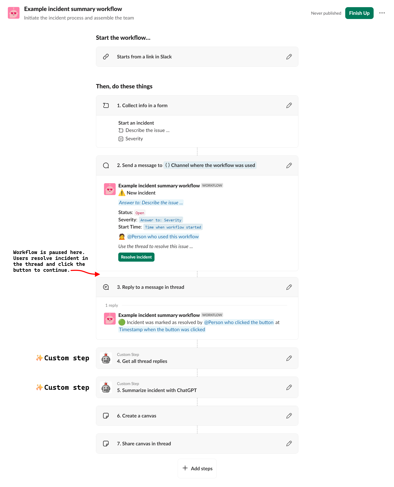

# AI for Incidents

#### Outline
- [Overview](#overview)
- [Setup](#setup)
- [Using functions in Workflow Builder](#using-functions-in-workflow-builder)
- [Implementation details](#implementation-details)
- [Project Structure](#project-structure)
- [Linting](#linting)

## Overview

This app is built using [Bolt for JavaScript](https://slack.dev/bolt-js) and includes two [custom functions for Bolt](https://api.slack.com/automation/functions/custom-bolt). These functions are meant to be deployed on your own infrastructure. This is different from the previously released [workflow apps](https://api.slack.com/automation/functions/custom) built with the Deno Slack SDK and are hosted on Slack's infrastructure.

The functions are modular! Once the app is installed, any builder with access to the functions can use them in their own workflows and mix-and-match as needed for their use case.

🧵 **Get all thread replies**
Fetch all replies from the referenced Slack thread. The timestamp, author, & text of each message are extracted and output via the `replies` property as a stringified array to be used in subsequent steps.

🤖 **Summarize incident with ChatGPT**
This step expects an array of Slack messages describing an incident and includes several hardcoded system prompts that instruct ChatGPT on how to interpret the inputs and what outputs are expected. ChatGPT returns a JSON object that is parsed and assigned to individual outputs: `summary`, `cause`, `impact`, `resolution`, `duration`, & `timeline`. Each can be used as individual variables in subsequent workflow steps.

## Setup

[](https://www.heroku.com/deploy)

Before getting started, first make sure you have a [developer workspace](https://api.slack.com/developer-program) where you have permission to install apps. **Please note that the features in this project require that the workspace be part of [a Slack paid plan](https://slack.com/pricing).**

### Clone the Template

Start by cloning this repository:

```zsh
# Clone this project onto your machine
$ slack create ai-for-incidents -t Slack-Partner-Engineering/ai-for-incidents

# Change into the project directory
$ cd ai-for-incidents

# Install dependencies
$ npm install
```

1. Create a new app from api.slack.com/apps using the included `manifest.json` file.
2. Ensure your app has opted into the [Org-wide apps](https://api.slack.com/enterprise/org-wide-apps) feature.
3. Install the app. If you are building in an Enterprise Grid, you [must install at the org-level](https://api.slack.com/automation/functions/custom-bolt#org-wide-apps). If you are building on a standalone workspace, this does not apply.
4. Create a copy of `.env.sample`, rename to `.env` and provide the required values: an OpenAI API key and three tokens from your newly created app.
5. Run your app locally with the `npm start` command or deploy to a hosting platform of your choice such as [Heroku](https://slack.dev/bolt-js/deployments/heroku).
6. Open [Workflow Builder](https://slack.com/help/articles/17542172840595-Build-a-workflow--Create-a-workflow-in-Slack) and create a new workflow that includes one or both of the provided functions. They will appear in the **Custom** section of the steps list for all users that have been [granted access](https://api.slack.com/automation/functions/custom#access).

## Using functions in Workflow Builder
With your server running, your function is now ready for use in [Workflow Builder](https://slack.com/help/articles/17542172840595-Build-a-workflow--Create-a-workflow-in-Slack)! They will appear in the **Custom** section of the steps list for all users that have been [granted access](https://api.slack.com/automation/functions/custom#access).

Download the included [workflow JSON file](./assets/example-incident-summary-workflow.json) to get started rebuilding this workflow in Slack. At this time, [exporting a workflow](https://slack.com/help/articles/30011815092499-Export-and-import-Slack-workflows#export-a-workflow) does not support non built-in steps. This means that the two custom steps in this app won't appear when imported. Add them yourself and made any edits as needed, specifically within the *Create a canvas* step where you will need to update the marked variable references to the outputs of the *Summarize incident with ChatGPT* step.

📥 [Example workflow *(json)*](./assets/example-incident-summary-workflow.json)



## Implementation details
The `get_thread` function outputs a `replies` JSON string. Here is an example of what you can expect this function to output for a Slack thread with a parent message and two nested replies:

```json
{
  "messages": [    
    {
      "author": "Adam",
      "message": "Our payments system stopped working",
      "datetime": "2024-04-11T22:59:01.000Z"
    },
    {
      "author": "Adam",
      "message": "10 customers have contacted our support team",
      "datetime": "2024-04-11T22:59:31.000Z"
    },
    {
      "author": "Jennifer",
      "message": "Not sure what is wrong, checking logs",
      "datetime": "2024-04-11T22:59:55.000Z"
    }
  ]
}
```

## Project Structure

### `.slack/`

Contains `apps.dev.json` and `config.json`, which include installation details for your project.

### `app.js`

`app.js` is the entry point for the application and is the file you'll run to start the server. This project aims to keep this file as thin as possible, primarily using it as a way to route inbound requests.

### `manifest.json`

`manifest.json` is a configuration for Slack apps. With a manifest, you can create an app with a pre-defined configuration, or adjust the configuration of an existing app.

### `slack.json`

Used by the Slack CLI to interact with the project's SDK dependencies. It contains script hooks that are executed by the CLI and implemented by `@slack/cli-hooks`. You have the option to specify a [deploy hook](https://api.slack.com/automation/functions/custom-bolt#specify) for your app, such that when you run `slack deploy`, your specified instructions will run.

## Linting
Run ESLint for code formatting and linting:

```zsh
$ npm run lint
```
